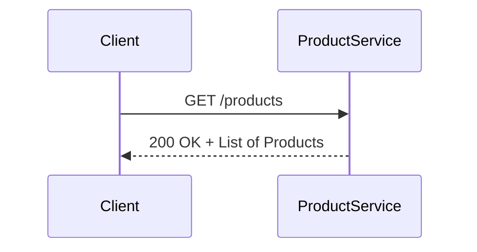
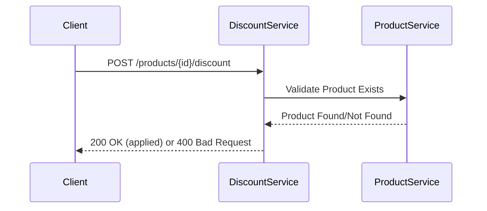
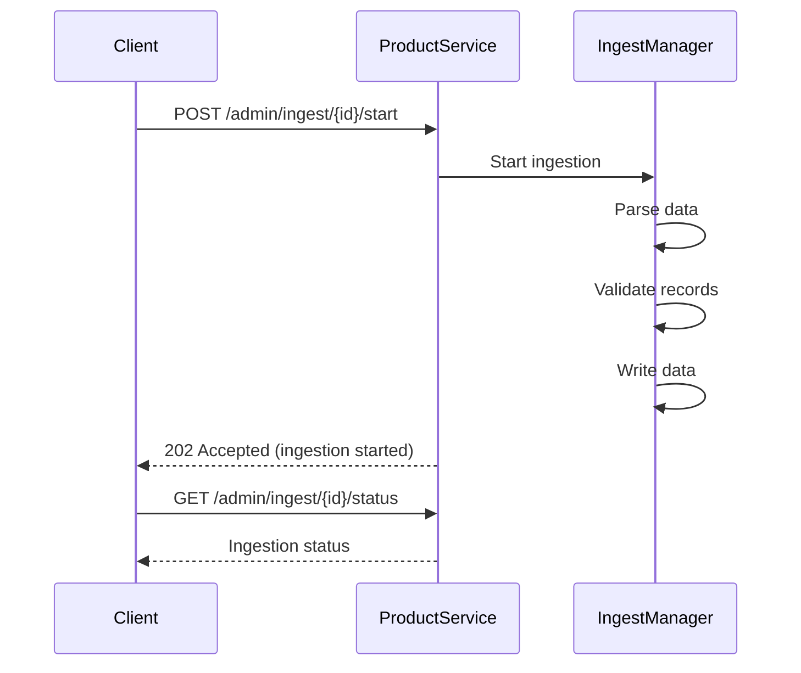
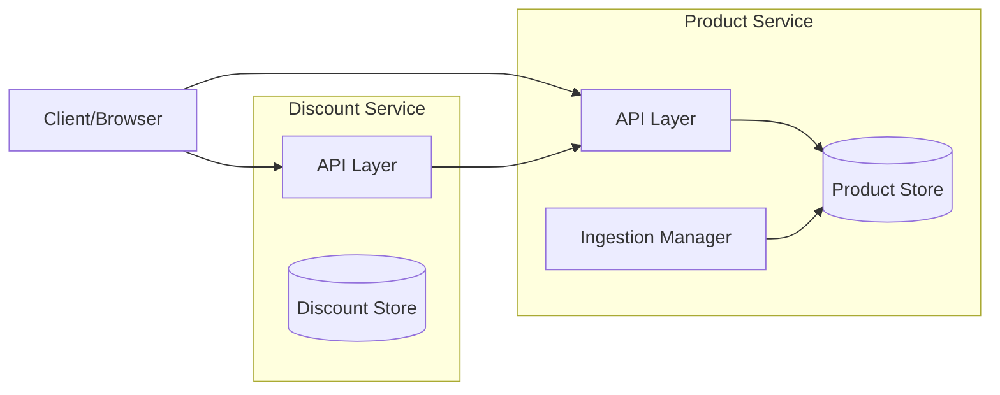

# Architecture Overview

This project implements a **two-service microservice architecture**:

- **Product Service**
  - Stores and serves product data
  - Provides endpoints for querying products
  - Exposes ingestion endpoints for product data

- **Discount Service**
  - Manages discount rules
  - Provides endpoints for applying discounts
  - Integrates with Product Service for validating product references

---

## ⚖️ Design & Trade-offs

- **Kotlin + Ktor**: Chosen for lightweight, coroutine-based async server design.
- **Two services**: Clear separation of concerns (products vs. discounts).  
  Trade-off: additional overhead in inter-service communication.
- **In-memory storage**: Simplifies implementation for this test.  
  Trade-off: not persistent, but enough to demonstrate architecture.
- **Docker Compose**: Simplifies running both services locally.  
  Trade-off: limited scalability vs. Kubernetes in production.

---

## 🔄 Sequence Diagrams

### GET /products

---

### POST /products/{id}/discount

---

### Ingestion Workflow

---

## 🧩 Component Diagram

